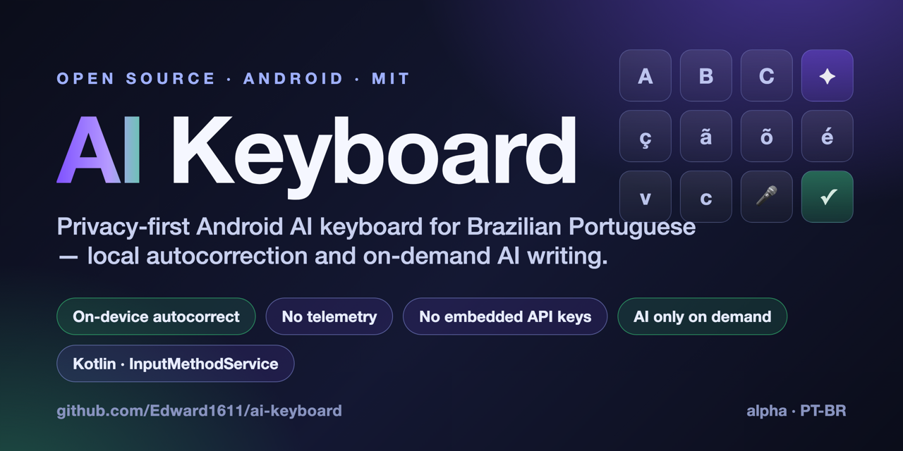
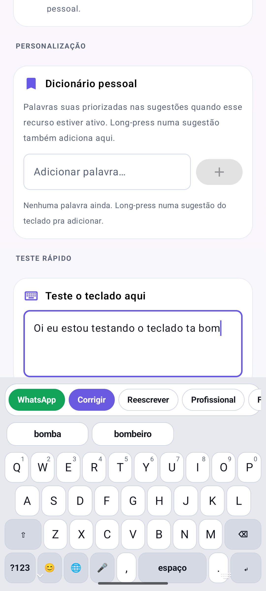
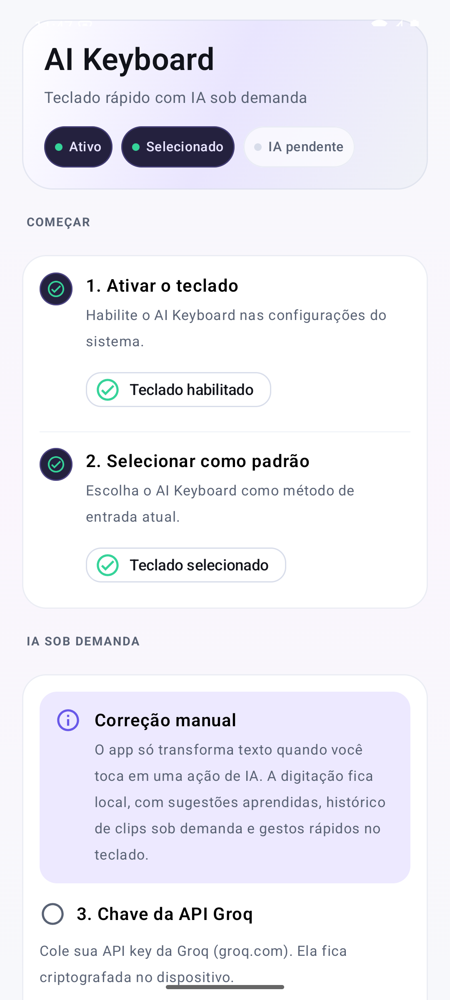

<!-- Cover: docs/assets/repository-cover.png — also set as the GitHub social preview in Settings. -->


# AI Keyboard

[](https://github.com/Edward1611/ai-keyboard/actions/workflows/android-tests.yml)


## Project overview

**AI Keyboard** is an open-source Android keyboard focused on **Brazilian Portuguese**, **privacy**, and **AI-assisted writing**.

It combines fast **on-device** autocorrection, PT-BR–aware suggestions, and **on-demand** AI actions such as correction, rewriting, summarization, WhatsApp-style text, and translation. Unlike AI writing tools that live inside a single app or a cloud platform, AI Keyboard works directly inside **any** Android text field through the system keyboard interface (`InputMethodService`) — while keeping every network request under the user's explicit control.

- 🇧🇷 Built for **Brazilian Portuguese** (slang-, abbreviation-, and laughter-aware)
- 🔒 **Privacy-first** — no analytics, no telemetry, no ad SDKs, **no API keys embedded in the build**
- 🤖 **AI only on explicit user action** — local typing never touches the network
- 🧪 **88 unit tests** + green CI, MIT-licensed, **alpha** and open to collaboration

> **Status: alpha.** Core keyboard behavior, local correction, AI actions, and provider integration are implemented and unit-tested, with CI green and a first release tagged. The project still needs more device testing, accessibility review, UI refinement, and community feedback. See [ROADMAP.md](ROADMAP.md).

## Why this project matters

Most AI writing tools are locked inside specific apps, cloud platforms, or commercial keyboards. AI Keyboard explores a **transparent, auditable, privacy-first** alternative for Android users — especially Portuguese-speaking users who need corrections that preserve slang, abbreviations, informal writing, and real conversational tone.

A keyboard sees **everything** a person types, so it is exactly the kind of software that should be open and inspectable. AI Keyboard is also a useful reference for developers who want to study **Android IME behavior**, **on-device autocorrection**, **encrypted key storage**, and **AI-assisted text transformation** inside system-level input fields.

The long-term goal is a **community-maintained** Android keyboard that combines local-first typing assistance, privacy-first design, and optional AI actions fully controlled by the user.

## Key features

- **QWERTY IME** (Portuguese + English) declared as an `InputMethodService`, rendered on a `Canvas` for minimal latency.
- **Instant, multitouch typing** — the character is committed on `ACTION_DOWN` (touch), not on release, so two thumbs can type in parallel without dropped keys.
- **Gesture (swipe) typing** decoded against the local PT-BR lexicon; alternatives stay tappable in the suggestion bar. Only turns into a swipe at 3+ keys, so a tap with a slight slide is never mistaken for a gesture.
- **Local PT-BR autocorrection** on word boundary, with selectable strength (Off / Light / Medium / Strong / Maximum) and **auto-undo**: a backspace right after a correction reverts it and records the pair as rejected.
- **Slang-safe correction** — `vc`, `pra`, `pq`, `blz`, laughter (`kkk`, `rsrs`), emphatic stretches (`siiim`), CamelCase brands (`iPhone`, `WhatsApp`) and tokens with digits are never "corrected". This is what makes aggressive levels trustworthy.
- **Field-aware** — password, email, URL, and numeric fields automatically disable autocorrection, suggestions, and auto-capitalization.
- **On-demand AI actions** in a scrollable bar above the keyboard: Correct, WhatsApp, Rewrite, Professional, Formal, Friendly, Shorten, Expand, Summarize, Emojify, and EN/PT-BR translation.
- **Groq** as the primary AI provider (`llama-3.3-70b-versatile`; WhatsApp mode uses `llama-3.1-8b-instant`) with an optional **Gemini** (`gemini-2.0-flash`) fallback.
- **Voice dictation** (🎤) via the native `SpeechRecognizer` (live PT-BR).
- **Rich suggestions** — tappable local corrections, next-word prediction, a personal dictionary, local frequency-based learning, and contextual emoji — in a fixed-height bar so keys never jump.

## Privacy and security

AI Keyboard is designed so that a keyboard — software that can observe everything you type — is **transparent and inspectable**.

- **No analytics, no telemetry, no advertising SDKs.** None are present in the dependencies or code.
- **Local autocorrection and suggestions run entirely on-device** and never touch the network.
- **AI runs only on explicit user action.** A request is made only when you tap an AI action, sent over HTTPS directly to the configured provider — never automatically or in the background.
- **API keys are provided by each user** inside the app and stored locally with `EncryptedSharedPreferences` (AES-256-GCM via AndroidX Security / Android Keystore).
- **No keys are embedded in the build.** The APK ships without any default or bundled API key — there is nothing to extract by decompiling it.

Full policy and reporting instructions: [SECURITY.md](SECURITY.md).

## Screenshots

The repository cover lives at [`docs/assets/repository-cover.png`](docs/assets/repository-cover.png). App screenshots will be added under [`docs/screenshots/`](docs/screenshots/).

| Screen | File (add under `docs/screenshots/`) | Status |
|--------|--------------------------------------|--------|
| Keyboard with suggestion bar | `keyboard-main.png` | _planned_ |
| AI action bar | `ai-actions.png` | _planned_ |
| Settings / setup screen | `settings.png` | _planned_ |
| Local autocorrection in action | `correction.png` | _planned_ |
| EN/PT-BR translation | `translation.png` | _planned_ |

> Screenshots are not committed yet (this is an alpha and screenshots must be captured on a device/emulator and verified to contain no personal data or API keys). To add them, drop the PNGs into `docs/screenshots/` and uncomment the block below.

<!-- Once the PNGs exist, uncomment to display them:





-->

## Architecture

### Request flow

```
┌─────────────────────────────────────────────────────────┐
│  User types or selects text in any app                   │
└────────────────────┬─────────────────────────────────────┘
                     ▼
┌─────────────────────────────────────────────────────────┐
│  AIKeyboardService (InputMethodService)                  │
│  ├─ Local autocorrect / suggestions (no network)         │
│  └─ On AI chip tap: read text via InputConnection,       │
│     apply system prompt, send to provider                │
└────────────────────┬─────────────────────────────────────┘
                     ▼
┌─────────────────────────────────────────────────────────┐
│  Groq API  →  (fallback) Gemini API   [HTTPS only]       │
└────────────────────┬─────────────────────────────────────┘
                     ▼
┌─────────────────────────────────────────────────────────┐
│  Text replaced in-place via                              │
│  InputConnection.beginBatchEdit + commitText             │
└─────────────────────────────────────────────────────────┘
```

### Tech stack

| Layer            | Technology                                                                 |
|------------------|----------------------------------------------------------------------------|
| Language         | Kotlin 2.0.21                                                               |
| Settings UI      | Jetpack Compose + Material 3                                                |
| Keyboard UI      | Custom `Canvas`/View rendering                                              |
| Build            | Gradle 9.0.0 + AGP 8.7.3, JDK 17                                            |
| HTTP             | OkHttp 4 + kotlinx.serialization                                            |
| Async            | Kotlin Coroutines                                                           |
| AI providers     | Groq (`llama-3.3-70b-versatile` / `llama-3.1-8b-instant`) + Gemini fallback |
| Secure storage   | AndroidX Security `EncryptedSharedPreferences` (user-entered keys)          |
| Min / Target SDK | 26 (Android 8.0) / 35 (Android 15), compileSdk 35                           |

### Project layout

```
app/src/main/java/com/aikeyboard/app/
├── KeyboardApp.kt          # Application + manual DI
├── MainActivity.kt         # Compose setup screen
├── ai/                     # AiClient, GroqClient, GeminiClient, TextCorrector,
│                           # AiOutputValidator, PromptPolicy
├── data/                   # ApiKeyStore (encrypted), Settings / Personalization /
│                           # UserDictionary / ClipboardHistory stores
└── ime/                    # AIKeyboardService (IME), KeyboardView, TypingEngine,
                            # LocalCorrections, PortugueseLexicon, FieldPolicy,
                            # VoiceInputController …
app/src/main/res/raw/pt_br_words.txt   # local PT-BR lexicon (~12k words)
app/src/test/java/com/aikeyboard/app/  # 88 JVM unit tests (8 files)
```

## Setup

### Prerequisites

- **Android Studio** (latest stable) with the Android SDK (compileSdk 35 / Build-Tools 35).
- **JDK 17** (the Gradle build targets JVM 17).

### 1. Clone and configure the SDK path

```bash
git clone https://github.com/Edward1611/ai-keyboard.git
cd ai-keyboard
cp local.properties.example local.properties
```

Edit `local.properties` and set `sdk.dir` to your Android SDK path. **`local.properties` is git-ignored and must never be committed.** You do **not** put API keys here — keys are entered inside the app at runtime and stored encrypted (see [SECURITY.md](SECURITY.md)).

### 2. Build

```bash
./gradlew assembleDebug          # debug APK
./gradlew assembleRelease        # release APK (unsigned)
```

### 3. Enable the keyboard

1. Install and open the **AI Keyboard** app.
2. Tap **Open keyboard settings** and enable AI Keyboard.
3. Tap **Select keyboard** and choose AI Keyboard as the current input method.
4. Paste your own Groq API key in-app and save it (stored with `EncryptedSharedPreferences`).
5. Open any app (WhatsApp, Notes, Chrome…), type, and tap an AI action.

### Signing a release (optional)

```bash
keytool -genkey -v -keystore release.keystore \
  -alias aikeyboard -keyalg RSA -keysize 2048 -validity 10000
# Add RELEASE_STORE_FILE / RELEASE_STORE_PASSWORD / RELEASE_KEY_ALIAS / RELEASE_KEY_PASSWORD
# to ~/.gradle/gradle.properties, then:
./gradlew assembleRelease
```

## Running tests

```bash
./gradlew test
```

The suite has **88 JVM unit tests** across 8 files covering the typing/autocorrect engine, field policy, AI transformation styles, and output validation. The same command runs in CI on every push and pull request. Instrumented IME tests are not yet implemented (tracked in the roadmap).

## Roadmap

A short selection — see [ROADMAP.md](ROADMAP.md) for the full plan.

- [x] Local PT-BR autocorrection with slang-safe, field-aware behavior
- [x] On-demand AI actions (correct / rewrite / summarize / WhatsApp / translate)
- [x] Groq + Gemini provider chain with encrypted key storage for user keys
- [x] 88 JVM unit tests for core logic + CI on every push/PR
- [x] No API keys embedded in the build (user-provided keys only)
- [ ] Instrumented IME tests
- [ ] App screenshots and demo
- [ ] Custom AI prompt actions
- [ ] Accessibility review

## Contributing

Contributions are welcome — see [CONTRIBUTING.md](CONTRIBUTING.md). Good first areas: PT-BR lexicon coverage, device testing, accessibility, tests, and documentation. Please never commit secrets, API keys, build outputs, or local environment files.

## License

Released under the [MIT License](LICENSE).

## How Codex can help this project

AI Keyboard is exactly the kind of project where AI-assisted maintenance pays off: it handles **sensitive user input**, so it needs careful, ongoing attention to **security, privacy, performance, and Android compatibility**.

[OpenAI Codex](https://openai.com/index/introducing-codex/) (and similar AI coding tools) would help maintain and grow the project by:

- **Expanding test coverage**, especially instrumented tests for `InputMethodService` / `InputConnection` behavior that the suite does not cover yet.
- **Reviewing security- and privacy-sensitive code** — key handling, the network paths, and ensuring no data leaves the device outside explicit AI actions.
- **Refactoring the AI provider layer** into a cleaner, plugin-style architecture that makes adding providers safe and easy.
- **Improving PT-BR correction quality and lexicon coverage** while preserving slang-safe behavior.
- **Strengthening AI output validation** and error handling across providers.
- **Improving documentation, onboarding, and contributor workflows**, and automating pull-request review.
- **Adding latency/performance benchmarks** to guard the keyboard's responsiveness.

The project is in **alpha**, but it already has a real, working foundation: an `InputMethodService` keyboard, on-device PT-BR correction, on-demand AI actions, encrypted user-key storage, **88 unit tests**, green CI, and a tagged release. That foundation is what makes focused AI-assisted contributions immediately useful. See [docs/codex-application.md](docs/codex-application.md) for the full application notes.
